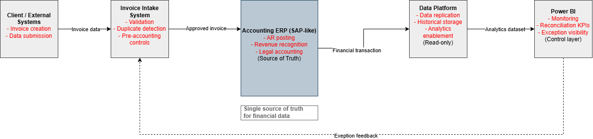
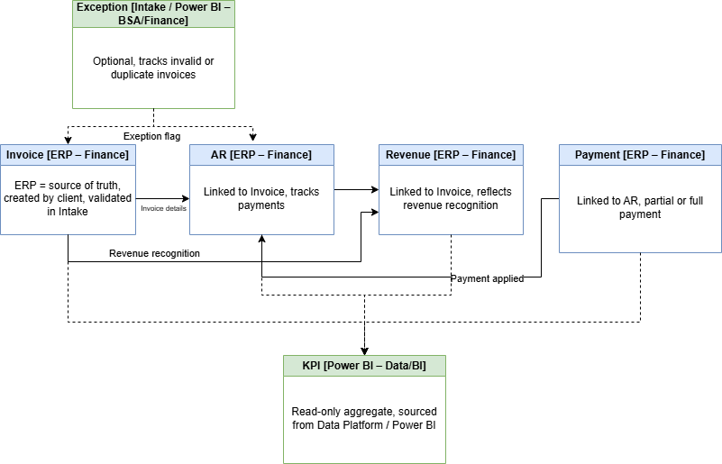

# Invoice-to-Cash Business Systems Analysis Portfolio

## Overview

This repository showcases an **end-to-end Business Systems Analysis (BSA) project** focused on the **Invoice-to-Cash (I2C)** process in a finance and ERP-driven environment.

The project demonstrates how a Business Systems Analyst bridges **business, finance, IT, and data teams** to deliver controlled, auditable, and scalable solutions.

---

## Business Problem

Finance organizations often struggle with:

* Duplicate or missing invoices
* Inconsistent AR and revenue postings
* Lack of visibility into exceptions
* Reconciliation gaps between ERP and analytics
* High audit risk during month-end close

This project addresses these challenges through **structured analysis, system design, and governance artifacts**.

---

## Role & Responsibilities

**Role:** Business Systems Analyst

Key responsibilities demonstrated:

* Business process analysis
* System and data architecture definition
* Requirements engineering (BR / FR / NFR)
* Test scenario and UAT support
* Financial reconciliation logic
* KPI and dashboard design
* Change management and impact analysis

---

## Solution Overview

The solution supports the **Invoice-to-Cash lifecycle**, including:

* Invoice intake and validation
* ERP posting (AR & Revenue)
* Exception handling
* Analytics and reporting
* Reconciliation and controls

ERP (SAP-style) acts as the **system of record**, while analytics platforms provide **read-only insights**.

---

## Repository Structure

```
├── README.md
├── docs/
│   ├── 01-business-context.md
│   ├── 02-process-flow.md
│   ├── 03-system-architecture.md
│   ├── 04-raci-and-ownership.md
│   ├── 05-data-model.md
│   ├── 06-requirements-and-backlog.md
│   ├── 07-test-scenarios-and-uat.md
│   ├── 08-data-reconciliation-and-kpis.md
│   ├── 09-change-management-and-impact-analysis.md
├── diagrams/
│   ├── I2C_Process_Flow.png
│   ├── I2C_Logical_System_Architecture.png
│   ├── I2C_HighLevel_DataModel.png
```

---

## Key Artifacts

### Invoice-to-Cash Process Flow


### Logical System Architecture



### High-Level Data Model



---

## Business Value Delivered

* Reduced duplicate invoice risk
* Improved financial traceability
* Faster issue detection through KPIs
* Strong audit and compliance readiness
* Clear ownership across teams

---

## Tools & Skills Demonstrated

* Business Systems Analysis
* Finance & Accounting Processes
* ERP (SAP FI/SD concepts)
* Requirements & UAT
* Power BI (conceptual dashboards)
* Data reconciliation logic
* Change governance

---

## Target Roles

This project is designed to support applications for:

* Business Systems Analyst
* ERP / SAP Analyst
* Finance Systems Analyst
* IT Business Analyst

---

## How to Use This Repository

* Start with this README
* Review documents in logical order (01 → 09)
* Refer to diagrams for visual understanding

---

## Contact

This is a portfolio project created for professional demonstration purposes.

---
